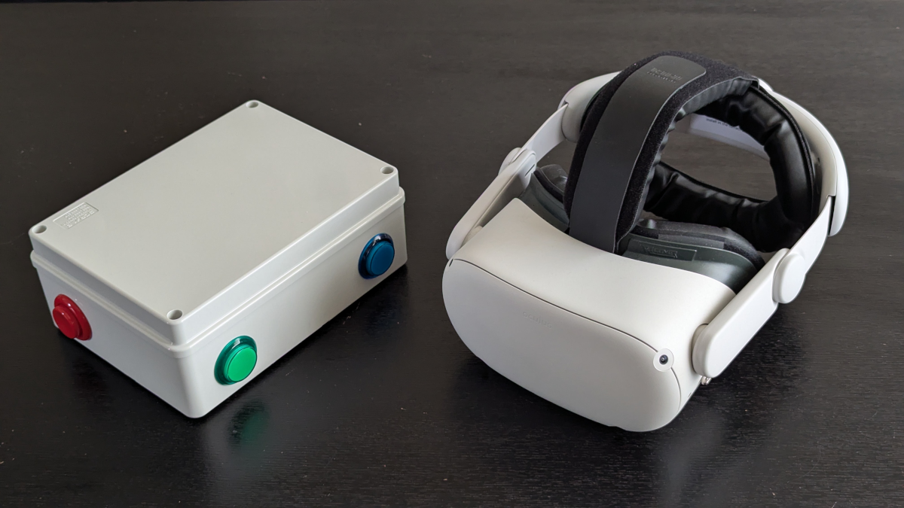

# Pico Quest Controller

Bluetooth controller for [Pinball FX VR](https://www.meta.com/fr-fr/experiences/pinball-fx-vr/7255396864545733/), built around a `Raspberry Pi Pico W`.  
  

PicoQuestPinball is a simple *"why not"* / *"proof of concept"*, for **evaluation** and **non-commercial-use**.  
For USB usage, please have a look at incredible [PinscapePico](https://github.com/mjrgh/PinscapePico) project.

## Reference

[Raspberry Pi Pico SDK](https://github.com/raspberrypi/pico-sdk)  
[BlueKitchen's BTstack](https://github.com/bluekitchen/btstack)  

Project is based on [https://mcuapplab.blogspot.com/2023/06/raspberry-pi-pico-w-btstack-ep-4-hid.html](https://mcuapplab.blogspot.com/2023/06/raspberry-pi-pico-w-btstack-ep-4-hid.html)  
Itself based on BTstack HID keyboard demo [https://github.com/bluekitchen/btstack/blob/master/example/hid_keyboard_demo.c](https://github.com/bluekitchen/btstack/blob/master/example/hid_keyboard_demo.c)

## Pinout

`Pinball FR VR` support external keyboard with following mapping :
- Left flipper : ` u ` key
- Right flipper : ` 6 ` key
- Launch ball :  ` 8 ` key
- Menu :  ` 5 ` key

- Nudge up : ` a ` key
- Nudge down : ` s ` key
- Nudge left : ` d ` key
- Nudge right : ` f ` key
  
Default Pico W GPIO pinout (see [board.h](board.h) file)
- Left flipper : 2
- Right flipper : 3
- Launch ball : 4
- Menu : 5

## Build

Get [pico-sdk](https://github.com/raspberrypi/pico-sdk) sources  

```shell
cd modules
git clone https://github.com/raspberrypi/pico-sdk.git
cd pico-sdk
git submodule update --init
cd ../..
```

### Terminal

`Pico W`

```shell
cmake -S . -B build -DPICO_PLATFORM=rp2040 -DPICO_BOARD=pico_w
cmake --build build
```

`Pico 2 W`

```shell
cmake -S . -B build -DPICO_PLATFORM=rp2350 -DPICO_BOARD=pico2_w
cmake --build build
```

### Visual Studio Code

Edit project local `.vscode/settings.json` file and add following lines :

For  `Pico W`

```json
    "cmake.configureSettings": {
        "PICO_PLATFORM": "rp2040",
        "PICO_BOARD": "pico_w"
    }
```

For `Pico 2 W`

```json
    "cmake.configureSettings": {
        "PICO_PLATFORM": "rp2350",
        "PICO_BOARD": "pico2_w"
    }
```

Press `F7` to build firmware
